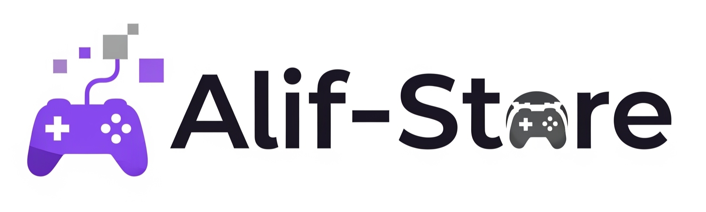
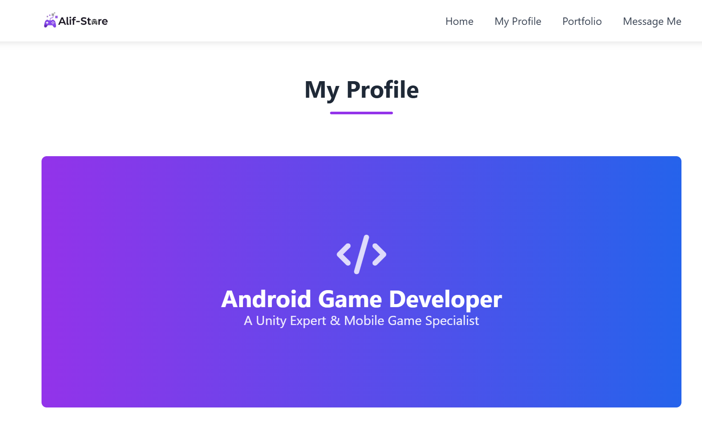

# Portofolio Pengembang Game - AlifAddarisalam



Ini adalah kode sumber untuk situs web portofolio pribadi saya, yang dibuat untuk menampilkan profil, keterampilan, dan proyek saya sebagai pengembang game Android. Proyek ini sepenuhnya responsif dan dibangun dengan HTML, Tailwind CSS, dan JavaScript untuk fungsionalitas dinamis.



## ✨ Fitur Utama

-   **Desain Responsif**: Tampilan yang dapat beradaptasi dengan baik di perangkat desktop maupun seluler.
-   **Animasi Interaktif**: Efek ketik pada sapaan, efek *hover* pada kartu, dan animasi *scroll* yang halus untuk pengalaman pengguna yang lebih menarik.
-   **Sapaan Dinamis**: Teks sapaan di bagian atas ("Hi There!") secara otomatis berubah sesuai dengan nama yang diinput pengguna pada formulir kontak.
-   **Galeri Portfolio**: Bagian untuk menampilkan game yang telah dibuat, lengkap dengan gambar ikon, deskripsi, dan tautan unduh eksternal.
-   **Formulir Kontak Fungsional**: Formulir dengan validasi input JavaScript untuk memastikan data yang dikirim benar (nama, email, telepon, dan pesan).
-   **Modal Notifikasi**: Menampilkan jendela *pop-up* (modal) konfirmasi setelah formulir berhasil dikirim, memberikan umpan balik langsung kepada pengguna.
-   **Navigasi Tetap (Sticky Navigation)**: Navbar akan tetap terlihat di bagian atas layar saat halaman di-scroll ke bawah.

## 🛠️ Teknologi yang Digunakan

-   **HTML5**: Untuk struktur dasar halaman web.
-   **Tailwind CSS**: Untuk styling dan tata letak yang cepat serta responsif.
-   **CSS3**: Untuk beberapa gaya kustom tambahan seperti gradien dan animasi.
-   **JavaScript (ES6+)**: Untuk fungsionalitas interaktif seperti menu seluler, validasi formulir, dan manipulasi DOM.
-   **Font Awesome**: Untuk ikon-ikon yang digunakan di seluruh situs.

## 🚀 Instalasi dan Penggunaan Lokal

Untuk menjalankan proyek ini di mesin lokal Anda, ikuti langkah-langkah berikut:

1.  **Clone repositori ini:**
    ```bash
    git clone [https://github.com/Aldwib/NamaRepoAnda.git](https://github.com/Aldwib/NamaRepoAnda.git)
    ```
    *(Ganti `NamaRepoAnda` dengan nama repositori Anda yang sebenarnya)*

2.  **Masuk ke direktori proyek:**
    ```bash
    cd NamaRepoAnda
    ```

3.  **Buka file `index.html`:**
    Cukup buka file `index.html` langsung di browser pilihan Anda (Google Chrome, Firefox, dll.). Tidak ada proses kompilasi atau server yang diperlukan.

## 🎨 Kustomisasi

Anda dapat dengan mudah menyesuaikan portofolio ini untuk kebutuhan Anda sendiri:

-   **Konten Teks**: Ubah semua informasi teks seperti "About Me", "Vision", "Mission", dan deskripsi game langsung di file `index.html`.
-   **Gambar**: Ganti gambar logo (`images/my-logo.png`) dan ikon game di bagian portfolio dengan gambar Anda sendiri. Pastikan untuk memperbarui path `src` di dalam tag ``.
-   **Tautan Sosial**: Perbarui tautan `href` untuk GitHub, Instagram, dan itch.io di bagian "Follow My Work" agar mengarah ke profil Anda.
-   **Warna**: Skema warna utama (ungu dan biru) dapat diubah dengan mengedit kelas gradien (`gradient-bg`) di `style.css` dan kelas warna Tailwind (`bg-purple-600`, `text-purple-600`, dll.) di `index.html`.

## 🧑‍💻 Kontak

Dibuat oleh **AlifAddarisalam**.

-   **GitHub**: [@Aldwib](https://github.com/Aldwib)
-   **Instagram**: [@alif_addarisalam.w](https://www.instagram.com/alif_addarisalam.w/)
-   **itch.io**: [alifaddarisalam](https://alifaddarisalam.itch.io)